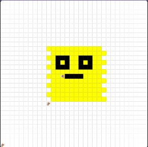

# asphalt-art-project
# Unit 1 - Asphalt Art

## Introduction

Cities use asphalt art to improve public safety, inspire their residents and visitors, and brighten communities. Your goal is to create asphalt art to revitalize The Neighborhood and bring the community together with the help of the Painter.

## Requirements

Use your knowledge of object-oriented programming, algorithms, the problem solving process, and decomposition strategies to create asphalt art:
- **Create a new subclass** – Create at least one new subclass of the PainterPlus class that is used for a component of the asphalt art design.
- **Plan an algorithm** – Use the problem solving process and decomposition strategies to plan an algorithm that incorporates a combination of sequencing, selection, and/or iteration.
- **Write a method** – Write at least one method in a PainterPlus subclass that contributes to a component of the asphalt art design.
- **Document your code** – Use comments to explain the purpose of the methods and code segments.

## Notes: Neighborhood & Painter Class

This project was created on Code.org's JavaLab platform using the built-in Neighborhood GUI output. To test and edit this project you must build in Code.org's JavaLab with the Neighborhood GUI enabled. For reference to the Painter class documentation, [you can read more here.](https://studio.code.org/docs/ide/javalab/classes/Painter)

## Output:

## Reflection

1. Describe your project.
- I decide to do a yellow smiley face because it kind of shows happiness and I also think fits being a community really well.

2. What are two things about your project that you are proud of?
- I am proud that the face is basically in the middle and that my mouth is not connected to the eyes as they once were. I am overall proud I was actualy able to do this project.

3. Describe something you would improve or do differently if you had an opportunity to change something about your project.
- I would try to break down my code a little more and use more while and for loops to help, next time I will plan better to have more of an idea instead of figuring out as I go.

4. How is this project related to STEAM (Science, Technology, Engineering, Art, and Mathematics)? Provide explicit examples from the project and details as possible. 
- This asphalt project used engineering and technology when creating the code, using code.org is the emaple for these 2 components. The art comes from the image its self in my case it is the smiley face with the white background. The science component is a little harder but I could say it was the formulas used in the code for example," public void paintFace() {
    startingPosition();
int count = 0;
    while(count < 6){
     paintLine(12,"yellow");
      leftToRight();

      paintLine(12,"yellow");
      rightToLeft();
      count++;
    }
  }." This shows the science and how we had to find the formula to get to the starting position.

5. What SLOs did you demonstrate during completing this project?
- The SLOs I demonstarted is the crtitcal thinker as I had to think in order to solve the problems I encountered, such as postions the smiley face and the actual feature of it. I also demonstated the Self-Directed, Goal Oriented, since I had to work on this project alone and manage my own time, while also keeping in mind my goals for this project.
